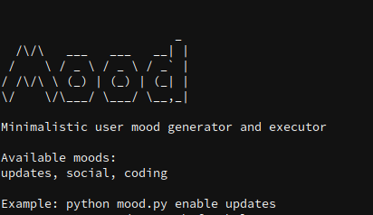

# Mood
 Minimalistic user mood generator and executor

 

 

Index

- [Usage](#usage)
    - [Enable mood](#enable-mood)
    - [Add new mood](#add-new-mood)
    - [Delete mood](#delete-mood)
    - [Help](#help)
- [Make mood file executable (optional)](#make-mood-file-executable)
- [Add mood is your PATH (optional)](#)

---------------------------------------------------

## Usage
### Enable mood

    python mood.py enable <mood_name>

### Add new mood:
    
    python mood.py add
Automatically open nano text editor.

Now you can add new moods in the `Add your moods here` section.

### Delete mood:

    python mood.py delete
### Help:

    python mood.py -h

## Make mood file executable (optional)
1.  You can mark your file as executable by running chmod command.
    
        chmod +x mood.py

2. Now we need to drop the .py extension. To do this we just have to rename it.

        mv mood.py mood

3. Add a shebang interpreter

    You will have to add a line to the code in the first line. It tells the computer to run the script as a Python file. The line to add is:

        #!/usr/bin/env python

4.  Let’s try and run it

        ./mood enable updates

## Add mood is your PATH (optional)
The last thing you need to change to make your Python script really seem like a shell command or system tool is to make sure it’s on your PATH.

I don’t recommend that you try to copy your script to a system directory like `/usr/bin/` or `/usr/local/bin` because that can lead to all kinds of odd naming conflicts (and, in the worst case, break your operating system install).

So instead, what you’ll want to do is to create a bin directory in your user’s home directory and then add that to the PATH.

1. First, you need to create the ~/bin directory:

        mkdir -p ~/bin

2. Next, copy mood script to ~/bin:
        
        cp mood ~/bin

3. Finally, add ~/bin to your PATH:
        
        export PATH=$PATH":$HOME/bin"

Adding ~/bin to the PATH like this is only temporary, however. It won’t stick across terminal sessions or system restarts. If you want to make your command permanently available on a system, do the following:

Add the this line to .profile : 
    
    export PATH=$PATH”:$HOME/bin”.
    
The changes can be observed after the terminal reloads or if you run a new session.

Now we can use the command that we created. Yay !!!

    mood enable updates

    